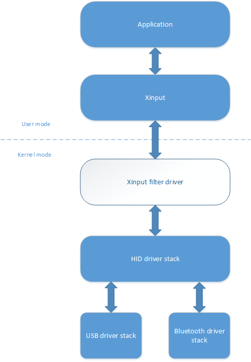

# Playstation-4-Controller-xusb-driver

This one is mostly for code sample than actual sharing and testing, since driver development/compilation is a bit complicated and requires a special setup. 
If someone want to test it anyway, you need vs2015 since 2017 doesnt support driver development, and the latest Windows Driver Kit (WDK).
You need to start the computer with driver signing disabled and install the driver on the HID ps4 controller.

## Controllers on Windows
Here is the situation about controllers on windows.
Since DirectX 8 there is a dedicated library called DirectInput that do permit control of Force feedback devices. 
DirectInput Force Feedback requires a COM dll component to be registered.
The API was very complete and had lots of settings.
Maybe it was too complicated I don't know, but it was never really used in games.
Not like there is a lot of force feedback controllers for Windows anyway.

Since the Xbox era, microsoft made the Xbox controller compatible with windows through a new library called XInput, making as a matter of fact DirectInput obsolete. 
XInput is much, much simpler and was made especially for Xbox controllers.
This new library is now widely used, and most game only support gamepads via XInput.
XInput as opposed to DirectInput speaks directly to the driver. And thus requires a custom device driver (where DirectInput only required a usermode component).

The thing is, as opposed to DirectInput, where the API was (not that well, but still) documented, XInput driver interface is kept private.
To write this driver I had to do some reversing on XInput, and see how it communicate with the driver.
From there I then created a filter driver that satisfies the requirements of XInput.

## Driver stack
The driver is a KMDF filter driver, that sits on top of the driver stack, above the default HID driver.
Below is an overly simplified diagram of the driver stack.

